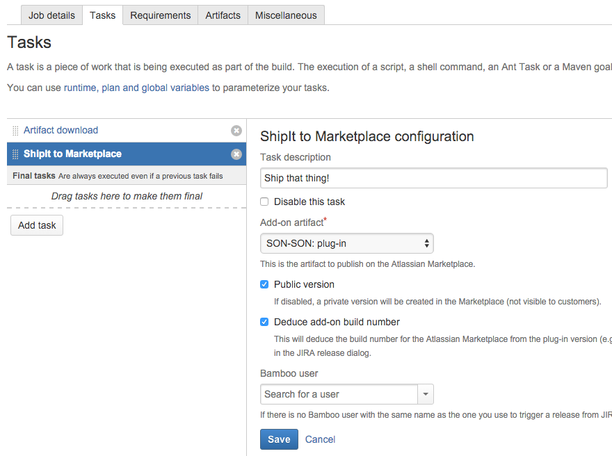
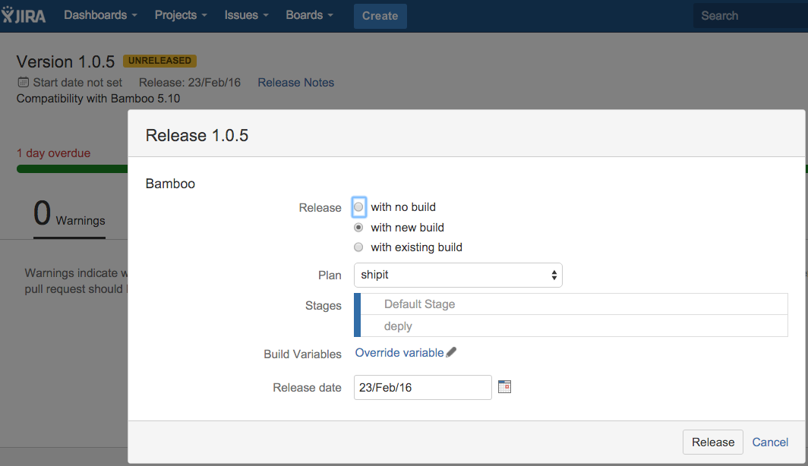
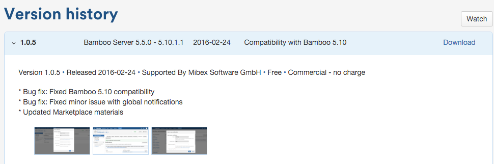
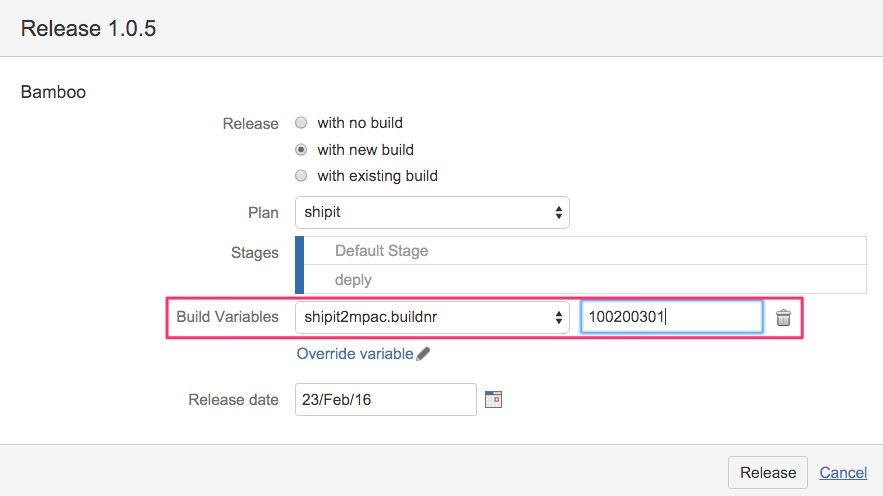

# ShipIt to Marketplace for Atlassian Bamboo

*Ship your plug-ins to the Atlassian Marketplace with one click*

*Presented at the AtlasCamp 2016 in Barcelona*

**Available in the [Atlassian Marketplace](https://marketplace.atlassian.com/plugins/ch.mibex.bamboo.shipit2mpac/server/overview)**

## About

This Bamboo task creates new versions of your Atlassian plug-ins by uploading them to the Atlassian Marketplace and by
providing all necessary information for a new plug-in version like release notes, build number, etc. It supports two 
ways of creating new plug-in versions:
 
1. You create a release with a new build from the JIRA release panel
2. You push new commits to a branch (e.g., master) or trigger a Bamboo build manually

For both use cases the plug-in collects the necessary information like the release version, the name and the summary 
from the associated JIRA version. This means that you don't have to supply all the information for a new Marketplace 
version of your plug-in manually, but instead this Bamboo task is able to do it for you. It also creates 
release notes based on the JIRA issues associated with a JIRA project version.

All you need to do is to add this Bamboo task to your build and configure like follows:

Then, create a release with a new build in JIRA:

Or push some code to the branch that is tracked by a Bamboo plan. This creates a new plug-in version in the Atlassian Marketplace:

This Bamboo task also supports deployment projects (but it doesn't support remote agents yet).

## Installation

Download and install the plug-in from the [Atlassian Marketplace](https://marketplace.atlassian.com/plugins/ch.mibex.bamboo.shipit2mpac/server/overview).

## Configuration

The Bamboo tasks configuration can be overridden by the following plan variables:
 
* shipit2mpac.jiraversion
* shipit2mpac.buildnr
* shipit2mpac.release.notes
* shipit2mpac.release.summary
* shipit2mpac.plugin.base.version

Overriding the build number is useful if you do not want the plug-in to deduce the build 
number from the plug-in's version number (e. g., a plug-in's version 1.2.3 results in the deduced build number 100200300).
To override this behaviour, just pass the build variable `shipit2mpac.buildnr` from the JIRA release dialog or from 
the Bamboo manual build trigger dialog:

Overriding the release summary and release notes can be useful if you don't want to take the summary from the JIRA
version description and the deduced release notes from the resolved JIRA issues.

The plug-in uses the last published plug-in version with the highest build number as the base version for the new Marketplace
submission. This means that version-specific content like application compatibility is copied from that base version to the
newly created plug-in version. If you want to use a different plug-in version as your base version, you can override the
described behaviour with the Bamboo variable `shipit2mpac.plugin.base.version`.

The Bamboo task requires that you configure an artifact to deploy as your new plug-in version. 
See [this Atlassian page](https://confluence.atlassian.com/display/BAMBOO058/Sharing+artifacts) on how to achieve this.
